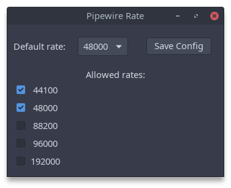

Primitive sample rate chooser for pipewire.

Configuration is stored in `~/.config/pipewire/pipewire.conf.d/pwrate.conf`

USAGE
=====

Make sure that `git` and `rust` are installed.

- `git clone https://github.com/pkunk/pwrate`
- `cd pwrate`
- `cargo run pwrate`

For ArchLinux `PKGBUILD` in `dist/` can be used.
